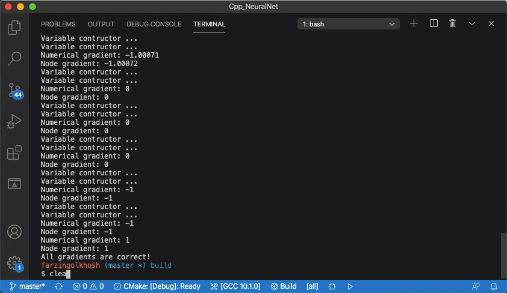

# EigenFlow
This project was inspired by Deep Learning From Scratch: Theory and Implementation [blog post](https://www.deepideas.net/deep-learning-from-scratch-theory-and-implementation/) by Daniel Sabinasz. This project implements an API to create computational graphs and neural nets using Eigen libraray in C++ from scratch. 

Currently, it only includes a gradient descent optimizer to minimize any user defined loss function. It currently uses dynamicly sized matrices everywhere. However, for large matrices the overhead might be reasonable and still efficient according to Eigen library documentation.

This project was created with educational purposes in mind and does not offer the most efficient way of implementing neural nets. It is best suited for people who are begineers in Machine Learning and Deep Learning. Re-implementation of different algorithms from scratch will help you increase your understanding. 


## Dependencies for Running 
* cmake >= 2.8
  * All OSes: [click here for installation instructions](https://cmake.org/install/)
* make >= 4.1 (Linux, Mac), 3.81 (Windows)
  * Linux: make is installed by default on most Linux distros
  * Mac: [install Xcode command line tools to get make](https://developer.apple.com/xcode/features/)
  * Windows: [Click here for installation instructions](http://gnuwin32.sourceforge.net/packages/make.htm)
* gcc/g++ >= 5.4
  * Linux: Install build -essentials ```sudo apt-get install build-essential``` 
  * Mac: same deal as make - [install Xcode command line tools](https://developer.apple.com/xcode/features/)
  * Windows: recommend using [MinGW](http://www.mingw.org/)
* Eigen3 >= 3.3
    * All Oses: clone the [git repository] (https://gitlab.com/libeigen/eigen.git)
    [download and extract Eigen's source code](http://eigen.tuxfamily.org/index.php?title=Main_Page#Download). 
    * build using ```cmake``` and ```make install```
    * The directory in which you placed Eigen's source code must be in the include path
    * Or use the -I option with GCC to achieve:
     ``` g++ -I /path/to/eigen/ my_program.cpp -o my_program ```

## Basic Build Instructions
1. Clone this repo.
2. Make a build directory in the top level directory: `mkdir build && cd build`
3. Compile: `cmake .. && make`
4. Run it: `./nn`.

## File Structure

Classes are template, but they are separated into ".h" and ".tpp" files to increase code readability. Relevant .tpp files are included at the end of each class declaration. 

```bash
.
├── CMakeLists.txt
├── LICENSE
├── README.md
├── data
│   ├── dev
│   └── test
├── image
│   ├── out1.gif
│   └── out2.gif
├── include
│   ├── NN.h
│   ├── gradientDescentOptimizer.h
│   ├── graph.h
│   ├── lockingPtr.h
│   ├── node.h
│   ├── operation.h
│   ├── optimization.h
│   └── session.h
└── src
    ├── NN.tpp
    ├── gradientDescentOptimizer.tpp
    ├── graph.tpp
    ├── lockingPtr.tpp
    ├── main.cpp
    ├── node.tpp
    ├── operation.tpp
    └── session.tpp
```


## Class Structure

General information for class structure of the API. For more detailed information about the interface, see the header files.

* ```node.h```
  * ```BaseNode```: 
    * Abstract base class for each node. Base class is implemented so that nodes of different types can be stored in a single container in computational graph
    * Stores pointers to inputs and consumer nodes and provides necessary accessors and mutators
    * Stores relevant informaiton about each node such as node's type and name
    * Provides pure virtual functions for computing inherited nodes values and gradients. Possible design patterns are CRTP, multi dispatching, and a map of pointers to functions. Since it's an abstract class upcasting to derived ```Node<T>``` class is safe as long as ```T``` is known and its the easiest to implement
  * ```Node<T>```: 
    * Inherits from ```BaseNode```. 
    * Stores output values and gradients with flags and conditional variables to check for data availability
    * Is a template abstract class; does not implement ```compute()``` and ```gradient()``` methods of the ```BaseNode```
    * Overrides ```clearGrads()``` of the base class
  * ```Variable<T>```: 
    * Inherits  from ```Node<T>``` 
    * Template class for variable nodes with relevant constructor that take value
    * Does not hold any data
    * Implemets the virtual methods of the base clas
  * ```Placeholder<T>```: 
    * Inherits  from ```Node<T>``` 
    * Template class for constant variable nodes in the graph. 
    * Constructor takes the name of the placeholder.
    * Holds no value
  
* ```operation.h```
  * ```Operation<T>```:
    * Inherits  from ```Node<T>```
    * Abstract base clase for operation
  * ```UnaryOperation<T>```:
    * Inherits from ```Operation<T>```
    * Factory constructor that accepts a single pointer to a node
  * ```BinaryOperation<T>```:
    * Inherits from ```Operation<T>```
    * Factory constructor that accepts two pointers to nodes 
  * ```Add<T,T1,T2>```: Performs addition and brodcasting when necessary
  * ```MatMultiply<T,T1,T2>```: Performs matrix multiply
  * ```Dot<T,T1,T2>```: Performs dot product
  * ```Multiply<T,T1,T2>```: Performs element-wise product
    * All inherit from ```BinaryOperation<T>```
    * Have relevant constructors
    * Override ```Compute()``` and ```gradient()```
  * ```Negative<T>```: Performs element-wise negation
  * ```Log<T>```: Performs element-wise log
  * ```Sigmoid<T>```: Element-wise sigmoid operation
  * ```Sum<T>```: Performs reduce sum on the given axis
    * All inherit from ```UnaryOperation<T>```
    * Have relevant constructors
    * Override ```Compute()``` and ```gradient()``` 
  * ```Minimizer<T>```:
    * Inherits from ```Operation<T>```
    * Has relevant move/assignment constructors (copy/assignment c'tor is deleted)
    * Overrides ```Compute()``` that performs gradient update 
* ```graph.h```
  * Stores pointers to nodes of the computational graph and ensures their existence thrughout the computation

* ```session.h```
  * Provides methods to get the nodes in post-ordet traversal and relevant accesor
  * Provides a ```Run``` method that takes a pointer to the node in the computational graph and runs relevant operations by calling ```compute()``` for each node. Also feeds the data to placeholders. 

* ```gradientDescentOptimizer.h```
  * Takes the learning rate and provides methods to perform backward propogation concurrently. 

* ```NN.h```
  *  Provides factory methods to create new unary and binary operations with dynamic memory allocation and store them using ```graph``` methods
  * Provides methods to run the operations by using methods from ```session``` 
  * Provides helper methods to check gradient calculations numerically for all the nodes
  
* ```lockingPtr.h```  
  * a wrapper class for raw and smart pointers with locking 
  * locks the object that the pointer points to when deferencing and calling other methods on them

## How to Use

Explanation of the example in main.cpp

Include the NN.h in your file:
```cpp
 #include "../include/NN.h" 
```

Create an alias for the dynamic eigen matrix type
```cpp
typedef Eigen::Matrix<long double, Eigen::Dynamic, Eigen::Dynamic> matxxf;
```

Then initialize a neural network NN class:
```cpp
NN nn = NN(); 
```

Define the number of steps for optimization
```cpp
int const STEPS = 10000; 
```

Use nn.spaceholders for constants and nn.variables for learnable variables, see the main.cpp for example:

(Use ```long double``` if you want to check the gradient calculations numerically.)

```cpp 
// matrix of scalar 1
Eigen::Matrix<long double, 1, 1> One;
One << 1; 

// cast to dynamic matrix
matxxf n = One;
BaseNode *one = nn.placeholder<long double>("one");

// Bias (m*1)
Eigen::Matrix<long double, 1, 1> B;
B << 0.1;
BaseNode *b = nn.variable<long double>(std::move(B));
    
// Wieghts (nh*nx)
Eigen::Matrix<long double, 1, 2> W;
W << 0.1, 0.2;
BaseNode *w = nn.variable<long double>(std::move(W));

// Training Data (nx*m)
Eigen::Matrix<long double, 2, 1> X;
X << 3, 2;
// cast to dynamic matrix
matxxf x = X;

// Labels (1*m)
Eigen::Matrix<long double, 1, 1> Y;
Y << 1;
// cast to dynamic matrix
matxxf yy = Y;
BaseNode *y = nn.placeholder<long double>("Y");
```
Create the activation function:
```cpp
// activation unit sigmoid(w^T*x+b) (nh*m)
BaseNode *a = nn.sigmoid<long double>(nn.add<long double>(nn.matmultiply<long double>(w, nn.placeholder<long double>("X")), b));
```

Create the loss function:
```cpp
// intermidiate loss function
// create loss function -(y*log(a)+(1-y)*log(1-a))
BaseNode *L = nn.negative<long double>(nn.add<long double>(nn.matmultiply<long double>(y, nn.log<long double>(a)), nn.matmultiply<long double>(nn.add<long double>(one, nn.negative<long double>(y)), nn.log<long double>(nn.add<long double>(one, nn.negative<long double>(a))))));
```
 
Create optimization operation:
```cpp
 // Create gradient descent optimization
    auto opt = GradientDescentOptimizer(0.01).minimize<matxxf>(L);
```

Create an unordered_map to feed the data for placeholders:
```cpp
// Create a map to feed data to the placeholders (i.e. "X" = X)
    std::unordered_map<std::string, matxxf *>
        feed = {};
    feed["X"] = &x;
    feed["Y"] = &yy;
    feed["one"] = &n;
```
Use nn.run to run the operations:
```cpp
// Run  operation
nn.run<long double>(L, feed);
```

Create a loop for optimizaiton and run optimization oprations
```cpp
for (int i = 1; i < STEPS; i++)
    {
        nn.run<long double>(&opt, feed);
        nn.run<long double>(L, feed);
        if (i % 1000 == 0)
        {
            std::cout << "Step " << i << std::endl;
            std::cout << "Activation: " << *(a->getValue<matxxf>()) << std::endl;
            std::cout << "loss: " << *(L->getValue<matxxf>()) << std::endl;
            std::cout << "Weights: " << *(w->getValue<matxxf>()) << std::endl;
            std::cout << "Bias: " << *(b->getValue<matxxf>()) << std::endl;
        }
    }
```

Use nn.checkAllGradient() to see if the gradient calculations are correct. It compares the gradients with numerically obtained values. For best results make sure the learning rate is set to zero. See the implementaiton for further information:
```cpp
 /* Check gradients -- Make sure to set learning rate to zero befor checking!! -- */
    nn.checkAllGradient(L, feed);
```

## Expected Output



## References and Useful Resources

1 - To learn about the matrix calculus required for Neural Nets see [explaned.ai](https://explained.ai/matrix-calculus/index.html) by Terence Parr and Jeremy Howard

2 - To learn more about Deep Learning read the book ["Deep Learning"](http://www.deeplearningbook.org/) by Ian Goodfellow and Yoshua Bengio and Aaron Courville

3 - Deep Learning From Scratch: Theory and Implementation [blog post](https://www.deepideas.net/deep-learning-from-scratch-theory-and-implementation/) by Daniel Sabinasz

4 - To learn more about [Eigen library](http://eigen.tuxfamily.org/dox/modules.html) see the documentation

5 - To learn the basics of C++ and get started see [Udacity Cpp ND](https://www.udacity.com/course/c-plus-plus-nanodegree--nd213)

## Capston Project Rubric

* For loops and while loops and different control structures:
  * The project demonstrates an understanding of C++ functions and control structures.
    * ```node.tpp```
    * ```operation.tpp``` in ```compute``` and ```gradient``` methods
    * ```gradientDescentOptimizer.tpp``` in ```computeGradients``` and ```getNodeQueue```
  
* Object Oriented Programming
  * The project uses Object Oriented Programming techniques.
    * ```node.h```
    * ```operation.h```
    * ```NN.h```
  * Classes use appropriate access specifiers for class members
     * ```node.h```
  * Class constructors utilize member initialization lists.
      * line 459 in ```operation.tpp```  and all binary and unary operation constructors:
        * lines: 33, 39, 172, 178, 203, 209, 245, 250, 289, 295, 328, 334, ...  
  * Classes abstract implementation details from their interfaces. 
      * ```node.h``` and ```node.tpp``
      * ```operation.h``` and ```operation.tpp```
      * ```session.h``` and ```session.tpp```
      * ```gradientDescentOptimizer.h``` and ```gradientDescentOptimizer.tpp```
      * ```NN.h``` and ```NN.tpp```

  * Classes encapsulate behavior. 
    * ```BaseNode``` class in ```node.h```  

  * Classes follow an appropriate inheritance hierarchy.
    * ```Variable``` and ````Placeholder``` and ```Operation``` inherit from ```Node``` that inherits from ```BaseNode```
    * ```UnaryOperation``` and ```BinaryOperation``` inherits from ```Operation``` and any mathematical operation inherits from ```UnaryOperation``` or ```BinaryOperation``` 

  * Derived class functions override virtual base class functions.
    * ```compute``` and ```gradient``` and ``` updateValue``` 

  * Templates generalize functions in the project.
    * almost all classes are template

  * The project makes use of references in function declarations.
    * mathematical operation constructors take value by ref or ptr
      * ```operation.h``` lines 37, 49, 61, 73, 85, 97, 109, 121,
      
  * The project follows the Rule of 5.  
    * ```node.h``` lines 118, 119, 120, 121, 122  
    * ```operation.h``` in ```Minimizer``` class
    * ```lockingPtr.h``` 

  * The project uses move semantics to move data, instead of copying it, where possible. 
    * ```node.h``` in ```Node``` class lines 93, 118, 116, 

  * The project uses smart pointers instead of raw pointers.
    * ```node.h``` lines 106, 107
    * ```graph.h``` lines 18

* Concurrency
  * The project uses multithreading.
    * ```gradientDescentOptimizer.tpp``` lines  25

  * A promise and future is used in the project. 
    * ```gradientDescentOptimizer.tpp``` lines  13, 25, 28

  * A mutex or lock is used in the project.
    * ```node.tpp``` lines   7, 13, 27, 41, 60, 75, ...
    
  * A condition variable is used in the project. 
     * ```node.tpp``` line 162
